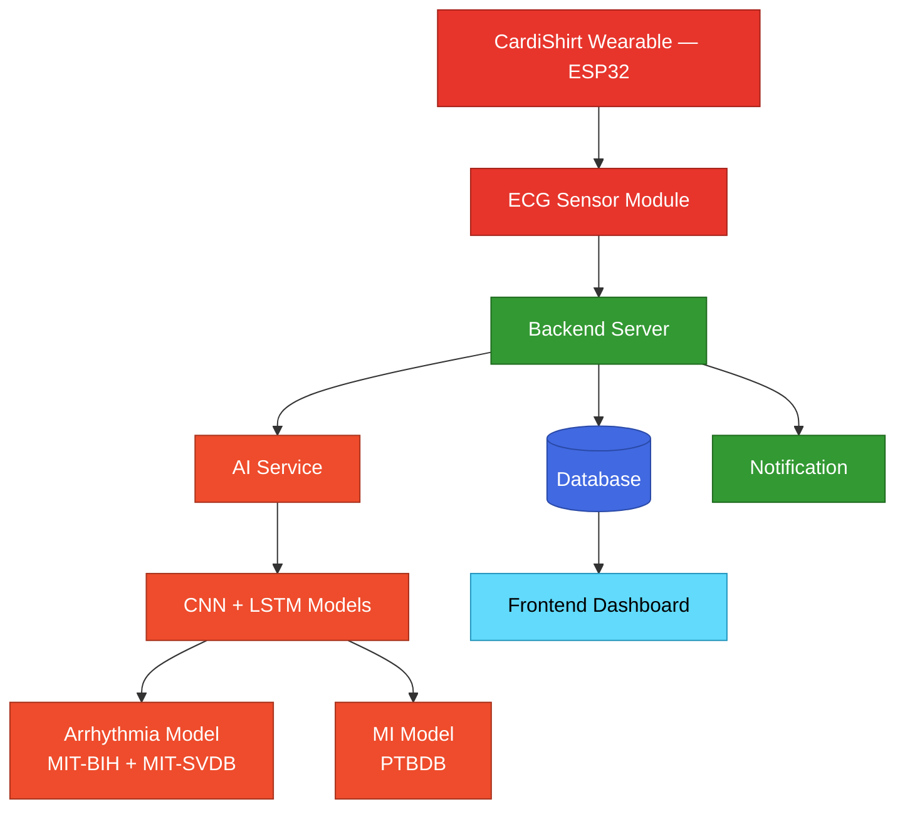
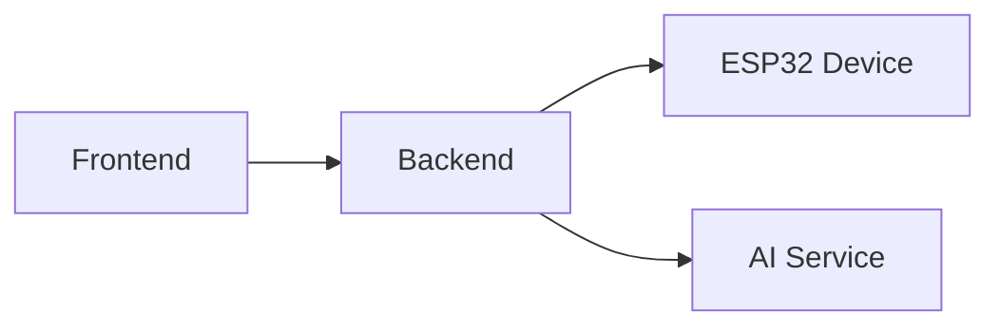
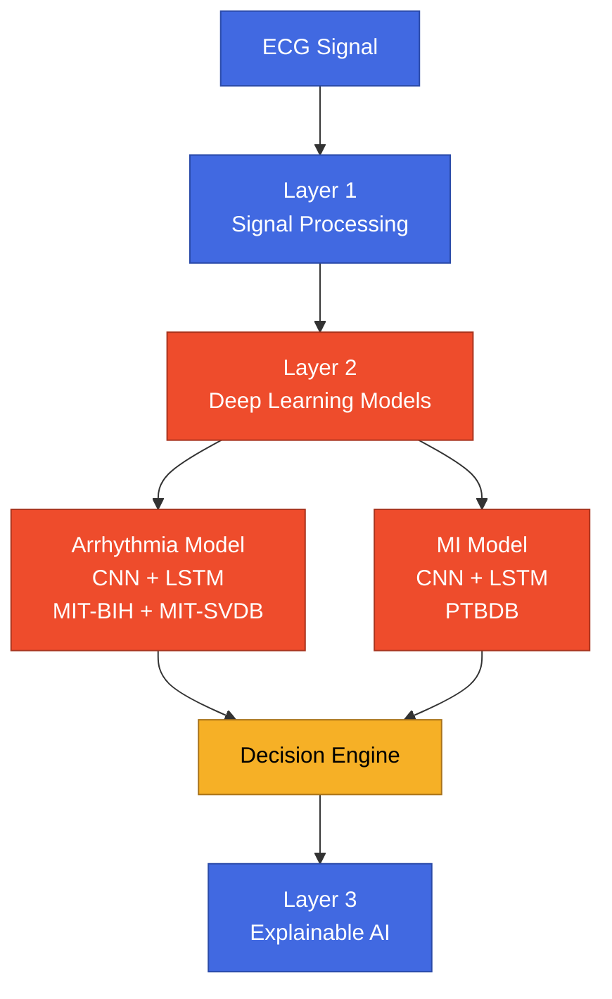
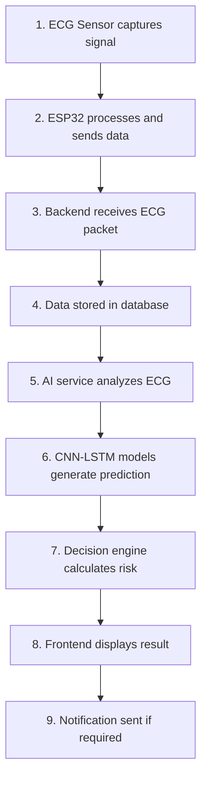

<div align="center">

# 🫀 CardiShirt

### AI-Powered Wearable ECG Monitoring System

*Continuous cardiac monitoring and early risk screening, powered by IoT and deep learning.*


</div>

---

## Table of Contents

- [Project Overview](#project-overview)
- [System Architecture](#system-architecture)
- [Main Components](#main-components)
- [AI Architecture](#ai-architecture)
- [AI Models](#ai-models)
- [Why CNN + LSTM?](#why-cnn--lstm)
- [Wearable Hardware](#wearable-hardware)
- [Complete Data Flow](#complete-data-flow)
- [Features](#features)
- [Repository Structure](#repository-structure)
- [Installation](#installation)
- [Environment Variables](#environment-variables)
- [Future Improvements](#future-improvements)
- [Technologies Used](#technologies-used)

---

## Project Overview

CardiShirt aims to provide an **affordable and intelligent cardiac monitoring solution** by continuously collecting ECG signals from a wearable device and analyzing them using AI.

The system can:

- 📡 Capture real-time ECG signals
- ❤️ Monitor heart rate
- 📊 Calculate HRV features
- 🔍 Detect abnormal rhythms
- 🚨 Detect possible myocardial infarction patterns
- 🧮 Generate cardiac risk levels
- 🤖 Provide AI-generated explanations
- 📣 Notify users and emergency contacts

---

## System Architecture



---

## Main Components

CardiShirt consists of three major parts:

```
CardiShirt
│
├── Frontend
├── Backend
└── AI Training Pipeline
```

### 1. Frontend

| | |
|---|---|
| **Technology** | React.js + Vite |
| **Location** | Repository root — see the [correction note](#repository-structure) below |

The frontend provides the user interface for:

- Dashboard monitoring
- ECG visualization
- Risk analysis
- AI explanation
- Health diary
- Emergency contacts
- User settings

**Main features:**

✅ Real-time health dashboard
✅ ECG waveform visualization
✅ AI prediction display
✅ Alert management
✅ Health history tracking

### 2. Backend

| | |
|---|---|
| **Technology** | Node.js, Express.js, Prisma ORM, PostgreSQL |
| **Location** | `backend/` |

The backend works as the communication bridge between:



**Responsibilities:**

- User authentication
- Device management
- ECG data receiving
- Database storage
- AI communication
- Risk calculation
- Emergency notification

**Main technologies:**

| Technology | Purpose |
|---|---|
| Express.js | REST API |
| Prisma | Database ORM |
| PostgreSQL | Data storage |
| JWT | Authentication |

### 3. AI Training Pipeline

| | |
|---|---|
| **Technology** | Python, PyTorch, FastAPI |
| **Location** | `ai-training/` |

The AI pipeline performs:

- ECG preprocessing
- Feature extraction
- Arrhythmia detection
- MI detection
- Risk evaluation
- Explanation generation

---

## AI Architecture



---

## AI Models

### Arrhythmia Detection

| | |
|---|---|
| **Model** | CNN + LSTM |
| **Dataset** | MIT-BIH Arrhythmia Database + MIT Supraventricular Arrhythmia Database |
| **Purpose** | Detect abnormal heart rhythms |

Examples detected: Normal rhythm, PVC, PAC, and other rhythm abnormalities.

### Myocardial Infarction Detection

| | |
|---|---|
| **Model** | CNN + LSTM |
| **Dataset** | PTB Diagnostic ECG Database |
| **Purpose** | Detect ECG patterns related to myocardial infarction |

The model learns: ST abnormalities, ECG morphology changes, and MI-related waveform patterns.

---

## Why CNN + LSTM?

ECG signals contain two important types of information:

| Network | Learns |
|---|---|
| **CNN** | Waveform shape, QRS morphology, local ECG patterns |
| **LSTM** | Heartbeat sequence, rhythm changes, temporal dependencies |

**Combining CNN + LSTM = ECG morphology understanding + rhythm understanding.**

---

## Wearable Hardware

| | |
|---|---|
| **Platform** | ESP32 |
| **Sensors** | ECG sensor, Accelerometer |

The wearable device collects:

- ECG samples
- Heart rate
- Motion information
- Fall detection information

**Communication:** ESP32 → Backend, via a REST API over HTTP.

> [!WARNING]
> This was previously documented as WebSocket — checked against the actual backend code (`package.json` has no `ws`/`socket.io` dependency, and `/api/ecg/ingest` is a plain Express `POST` route), so this has been corrected to REST/HTTP.

---

## Complete Data Flow



---

## Features

### ECG Monitoring
- Real-time ECG streaming
- ECG waveform visualization
- Signal quality checking

### Cardiac Analysis
- Heart rate monitoring
- HRV calculation
- Arrhythmia detection
- MI risk screening

### AI-Based Risk Assessment

Possible outputs:


### Emergency Support

The system can:

- Notify users
- Notify family members
- Send emergency alerts

---

## Repository Structure

> [!WARNING]
> **Correction from the original doc:** the frontend isn't in its own `frontend/` folder — its source (`components/`, `pages/`, `services/`, `routes/`, `store/`, etc.) lives directly under `src/` at the repository root, alongside `vite.config.js`, `index.html`, and `package.json`. The tree below reflects the real, current layout. This also affects the [Installation](#installation) commands further down.

<details>
<summary>📁 Click to expand full repository tree</summary>

```
CardiShirt/
│
├── src/                      # Frontend source (React + Vite)
│   ├── components/
│   ├── pages/
│   ├── services/
│   ├── routes/
│   └── store/
├── public/
├── index.html
├── vite.config.js
├── package.json
│
├── backend/
│   ├── controllers/
│   ├── routes/
│   ├── services/
│   ├── prisma/
│   └── server.js
│
├── ai-training/
│   ├── data/
│   ├── src/
│   ├── models/
│   ├── train.py
│   ├── train_mi.py
│   └── README.md
│
├── hardwareCode/             # ESP32 firmware
│
└── README.md
```

</details>

---

## Installation

### Clone Repository

```bash
git clone https://github.com/yourusername/CardiShirt.git
cd CardiShirt
```

### Frontend Setup

> Run from the **repository root** — there's no separate `frontend/` folder to `cd` into (see the [Repository Structure](#repository-structure) note above).

```bash
npm install
npm run dev
```

Runs at:

```
http://localhost:5173
```

### Backend Setup

```bash
cd backend
npm install
```

Configure your `.env` file (see [Environment Variables](#environment-variables)), then:

```bash
npm run dev
```

Backend runs at:

```
http://localhost:5000
```

### AI Setup

```bash
cd ai-training
python -m venv venv
source venv/bin/activate
pip install -r requirements.txt
```

Run:

```bash
python src/api/main.py
```

AI API runs at:

```
http://localhost:8000
```

---

## Environment Variables

> [!TIP]
> **Expanded from the original doc** to match what the backend actually requires today — the AI-explanation and family-notification features need a few keys that weren't previously listed.

**Backend** (`backend/.env`):

```env
DATABASE_URL=
JWT_SECRET=
PORT=5000

# AI-generated explanations (Gemini)
GEMINI_API_KEY=

# Family/emergency notifications
TELEGRAM_BOT_TOKEN=
TWILIO_ACCOUNT_SID=
TWILIO_AUTH_TOKEN=
TWILIO_PHONE_NUMBER=

# Optional — tunes how device readings roll into daily metrics
DEVICE_SAMPLE_INTERVAL_MIN=1
```

**Frontend** (`.env`, repository root):

```env
VITE_API_URL=
```

**AI** (`ai-training/.env`):

```env
MODEL_PATH=
```

---

## Future Improvements

- Larger multi-lead ECG support
- Mobile application
- Cloud deployment
- Federated learning
- More cardiac disease classification
- Clinical validation

---

## Project Goal

CardiShirt aims to build an affordable AI-powered wearable ECG monitoring platform that enables early cardiac risk screening and continuous health monitoring.

---

## Technologies Used

<table>
<tr>
<td valign="top">

**Frontend**
- React.js
- Vite
- Redux Toolkit
- Axios

</td>
<td valign="top">

**Backend**
- Node.js
- Express.js
- Prisma
- PostgreSQL

</td>
<td valign="top">

**AI**
- Python
- PyTorch
- CNN-LSTM
- FastAPI

</td>
<td valign="top">

**Hardware**
- ESP32
- ECG Sensor
- Accelerometer

</td>
</tr>
</table>

<div align="center">

---

🫀 **Made for early cardiac risk screening, one heartbeat at a time.**

</div>
