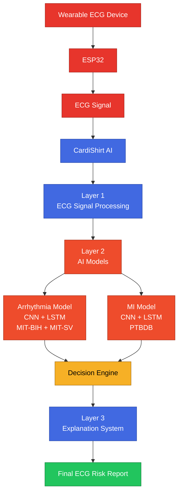
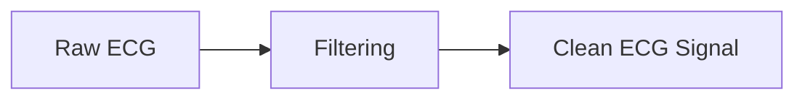
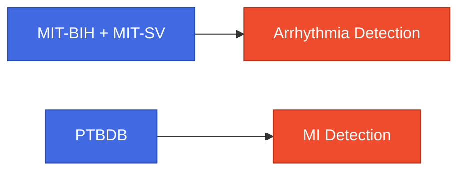
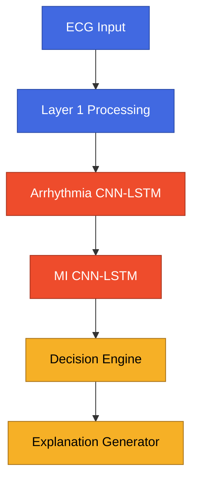

<div align="center">

# 🧠 CardiShirt AI Training Pipeline

### AI-Based ECG Risk Screening System

*A deep learning pipeline for wearable cardiac monitoring — from raw ECG signal to explainable risk report.*


</div>

---

## Table of Contents

- [Overview](#overview)
- [System Architecture](#system-architecture)
- [AI Pipeline Overview](#ai-pipeline-overview)
- [Layer 1: ECG Signal Processing](#layer-1-ecg-signal-processing)
- [Layer 2: AI Prediction Models](#layer-2-ai-prediction-models)
- [Why CNN + LSTM?](#why-cnn--lstm)
- [Arrhythmia Detection Model](#arrhythmia-detection-model)
- [Myocardial Infarction Detection Model](#myocardial-infarction-detection-model)
- [Why Different Datasets?](#why-different-datasets)
- [Dataset Setup](#dataset-setup)
- [Installation](#installation)
- [Data Preparation](#data-preparation)
- [Training Models](#training-models)
- [Model Evaluation](#model-evaluation)
- [AI Inference Pipeline](#ai-inference-pipeline)
- [Layer 2: Decision Engine](#layer-2-decision-engine)
- [Layer 3: Explanation System](#layer-3-explanation-system)
- [Running the AI API](#running-the-ai-api)
- [Project Structure](#project-structure)
- [Summary](#summary)

---

## Overview

CardiShirt AI is a deep learning-based ECG analysis pipeline designed for wearable cardiac monitoring.

The system receives ECG signals from a wearable device (ESP32 + ECG sensor), processes the ECG waveform, extracts physiological features, performs AI-based disease prediction, evaluates cardiac risk, and generates an understandable explanation.

**The AI system provides:**

- 🔍 Arrhythmia detection
- 🚨 Myocardial Infarction (MI) detection
- 📶 ECG signal quality assessment
- ❤️ Heart rate calculation
- 📊 HRV analysis
- 🧮 AI-based risk classification
- 🤖 Explainable cardiac reports

---

## System Architecture



---

## AI Pipeline Overview

CardiShirt AI follows a three-layer architecture.


| Layer | Name | Tasks |
|---|---|---|
| **1** | ECG Signal Processing | Filtering, noise removal, R peak detection, heart rate calculation, HRV calculation, signal quality checking |
| **2** | AI Disease Prediction | Arrhythmia detection, MI detection, risk decision |
| **3** | Explainable AI | Human-readable report, clinical recommendation |

---

## Layer 1: ECG Signal Processing

**Location:** `src/layer1/`

Layer 1 converts raw ECG samples into meaningful cardiac information.

**Files:**

```
layer1/
├── filtering.py
├── peak_detection.py
├── features.py
├── morphology.py
├── signal_quality.py
└── pipeline.py
```

### ECG Filtering

**File:** `filtering.py`

**Purpose:** remove ECG noise —

- Baseline drift
- High frequency noise
- Electrical interference



### R Peak Detection

**File:** `peak_detection.py`

R peaks are detected to calculate:

- Heart rate
- RR interval
- HRV

```
      R          R          R
      /\         /\         /\
_____/  \_______/  \_______/  \____
        RR1          RR2
```

### ECG Feature Extraction

**File:** `features.py`

| Feature | Description |
|---|---|
| **Heart Rate** | Beats per minute |
| **RR Interval** | Time between heartbeats |
| **SDNN** | HRV variation |
| **RMSSD** | Short term HRV |
| **pNN50** | Heart rhythm variability |

### Signal Quality Checking

**File:** `signal_quality.py`

Checks:

- Electrode connection
- Noise level
- Invalid ECG

Poor signals are classified as **`UNRELIABLE`**.

---

## Layer 2: AI Prediction Models

**Location:** `src/layer2/`

Layer 2 contains two separate deep learning models:

1. Arrhythmia Detection Model
2. Myocardial Infarction Detection Model

Separate models are used because arrhythmia and MI represent different cardiac conditions.

### CNN + LSTM Architecture

Both models use **CNN + LSTM**.

**CNN** — learns local ECG waveform features (QRS morphology, P wave, T wave, ST segment):


**LSTM** — learns temporal ECG patterns (heartbeat sequence, rhythm changes, RR relationship):


## Why CNN + LSTM?

ECG contains two important characteristics:

| Question | Handled by |
|---|---|
| **Spatial** — "What does one heartbeat look like?" | CNN |
| **Temporal** — "How do heartbeats change over time?" | LSTM |

**Therefore: CNN + LSTM = Morphology + Rhythm Understanding**

---

## Arrhythmia Detection Model

| | |
|---|---|
| **Purpose** | Detect abnormal heart rhythm |
| **Output** | `Normal` or `Abnormal` |
| **Model** | CNN + LSTM Binary Classifier |
| **Model file** | `data/ad8232_binary_arrhythmia_model.pt` |

### Arrhythmia Dataset

**Datasets used:** MIT-BIH Arrhythmia Database + MIT Supraventricular Arrhythmia Database

```
data/
├── mitdb/
└── svdb/
```

**Why MIT-BIH?** One of the most widely used ECG arrhythmia datasets. It provides ECG recordings, beat annotations, and different rhythm abnormalities (normal rhythm, PVC, PAC, bundle branch block). Suitable because arrhythmia depends mainly on beat morphology, rhythm variation, and RR interval changes.

**Why MIT-SV?** Provides additional supraventricular arrhythmias and atrial rhythm abnormalities. Combining MIT-BIH + MIT-SV creates better arrhythmia diversity.

---

## Myocardial Infarction Detection Model

| | |
|---|---|
| **Purpose** | Detect ECG patterns related to myocardial infarction |
| **Output** | `Normal` or `MI` |
| **Model** | CNN + LSTM Binary Classifier |
| **Model file** | `data/mi_model.pt` |

### MI Dataset

**Dataset:** PTB Diagnostic ECG Database

```
data/
└── ptbdb/
```

**Why PTBDB?** Contains healthy control ECG, myocardial infarction ECG, and clinically diagnosed cases, with MI-related ECG characteristics (ST changes, Q wave abnormalities, T wave changes).

---

## Why Different Datasets?

Arrhythmia and MI are different problems — **arrhythmia** is an electrical rhythm abnormality, while **MI** is heart muscle damage / ischemia. They require different ECG patterns.



---

## Dataset Setup

Required folder structure:

```
ai-training/
└── data/
    ├── mitdb/
    ├── svdb/
    └── ptbdb/
```

**Dataset downloads:**

| Dataset | Source | Place in |
|---|---|---|
| MIT-BIH | https://physionet.org/content/mitdb/ | `data/mitdb/` |
| MIT-SV | https://physionet.org/content/svdb/ | `data/svdb/` |
| PTBDB | https://physionet.org/content/ptbdb/ | `data/ptbdb/` |

---

## Installation

Create environment:

```bash
python -m venv venv
```

Activate (Mac/Linux):

```bash
source venv/bin/activate
```

Install dependencies:

```bash
pip install -r requirements.txt
```

---

## Data Preparation

### Arrhythmia Dataset

```bash
python prepare_data.py
```

Creates: `signals.npy`, `labels.npy`

### MI Dataset

```bash
python prepare_mi_data.py
```

Creates: `signals_mi.npy`, `labels_mi.npy`

---

## Training Models

### Train Arrhythmia Model

```bash
python train.py
```

Output: `ecg_model.pt`

### Train MI Model

```bash
python train_mi.py
```

Output: `mi_model.pt`

---

## Model Evaluation

### Arrhythmia Evaluation

```bash
python evaluate.py
```

Generates: `confusion_matrix.png`, `roc_curve.png`

### MI Evaluation

```bash
python evaluate_mi.py
```

Generates: `mi_confusion_matrix.png`, `mi_roc_curve.png`

---

## AI Inference Pipeline

**Main file:** `src/services/inference.py`



---

## Layer 2: Decision Engine

**Files:** `decision_pipeline.py`, `rule_engine.py`

Combines:

- AI predictions
- ECG features
- Signal quality

**Outputs:**


---

## Layer 3: Explanation System

**Location:** `src/layer3/`

**Components:**

```
layer3/
├── gemini_explainer.py
├── groq_explainer.py
└── local_llm_explainer.py
```

**Purpose:** convert AI output into understandable reports.

**Example:**

```
Risk Level: HIGH

Possible cardiac abnormality detected.
Medical assessment recommended.
```

---

## Running the AI API

Start:

```bash
python src/api/main.py
```

**Endpoint:** `POST /predict`

**Example request:**

```json
{
  "ecg": [0.12, 0.15, 0.18],
  "sampling_rate": 250
}
```

**Example response:**

```json
{
  "arrhythmia": "normal",
  "MI": "normal",
  "risk": "LOW"
}
```

---

## Project Structure

<details>
<summary>📁 Click to expand full project tree</summary>

```
ai-training/
├── data/
│   ├── mitdb/
│   ├── svdb/
│   └── ptbdb/
│
├── src/
│   ├── api/
│   │   ├── main.py
│   │   └── schemas.py
│   │
│   ├── layer1/
│   │   ├── filtering.py
│   │   ├── peak_detection.py
│   │   ├── features.py
│   │   ├── morphology.py
│   │   └── signal_quality.py
│   │
│   ├── layer2/
│   │   ├── arrhythmia_inference.py
│   │   ├── mi_inference.py
│   │   ├── decision_pipeline.py
│   │   └── rule_engine.py
│   │
│   ├── layer3/
│   │   └── (explanation modules)
│   │
│   └── services/
│       └── inference.py
│
├── train.py
├── train_mi.py
├── evaluate.py
├── evaluate_mi.py
│
├── model.py
├── mi_model.py
│
└── requirements.txt
```

</details>

---

## Summary

CardiShirt AI combines:

✅ ECG signal processing
✅ CNN-LSTM deep learning models
✅ MIT-BIH + MIT-SV arrhythmia datasets
✅ PTBDB MI dataset
✅ Risk decision engine
✅ Explainable AI

**The final system provides:**

- Real-time ECG analysis
- Arrhythmia detection
- MI detection
- Wearable ECG compatibility
- Explainable cardiac risk screening

<div align="center">

---

**CardiShirt AI** — AI-powered wearable ECG monitoring system.

</div>
